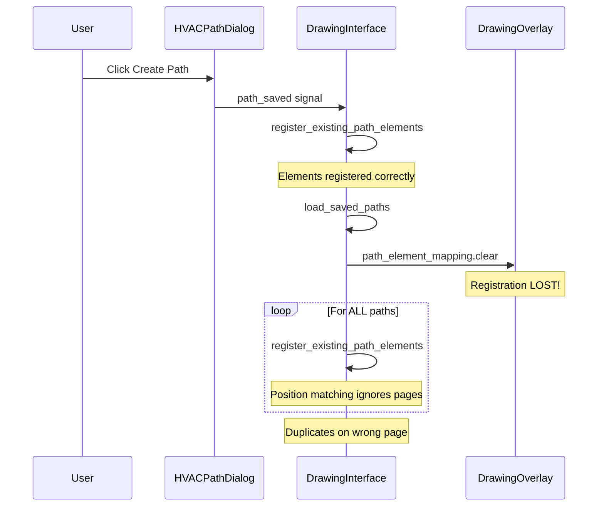
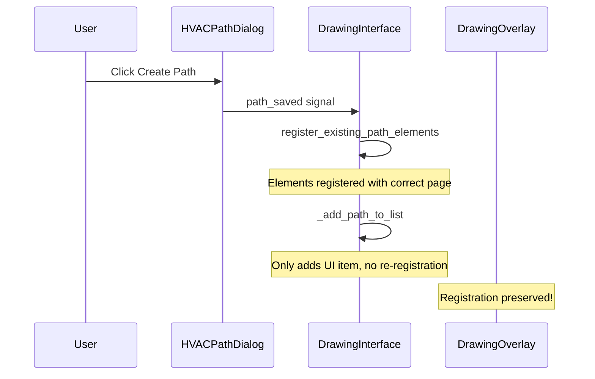

# HVAC Path Creation Duplicate Bug Fixes

## Problem Summary

When creating HVAC paths on page 2, duplicates appear on page 1 because:

1. Registration is immediately cleared after being set
2. Page numbers are not considered in position-based matching
3. Cross-page contamination occurs during path refresh

## Current Buggy Flow



## Fix Implementation

### Fix 1: Remove Redundant `load_saved_paths()` Call

**File:** [src/ui/drawing_interface.py](src/ui/drawing_interface.py)

**Location:** `create_hvac_path_from_components()` method, around line 2030

**Change:** Remove or conditionally skip the `load_saved_paths()` call after `on_path_saved` has already registered elements. Instead, just add the new path to the UI list without full refresh.

```python
# BEFORE (line 2030):
self.load_saved_paths()

# AFTER:
# Add new path to list without full refresh (registration already done in on_path_saved)
self._add_path_to_list(hvac_path)
```

Create a new helper method `_add_path_to_list(hvac_path)` that adds a single path item to `self.paths_list` without clearing/re-registering everything.

---

### Fix 2: Add Page Filtering to `is_near_path_position()`

**File:** [src/ui/drawing_interface.py](src/ui/drawing_interface.py)

**Location:** `load_saved_paths()` method, lines 3031-3055

**Change:** Modify the position collection and filtering to include page numbers:

```python
# BEFORE (lines 3032-3042):
path_component_positions = set()
for hvac_path in hvac_paths:
    for seg in hvac_path.segments:
        if seg.from_component:
            path_component_positions.add(
                (seg.from_component.x_position or 0, seg.from_component.y_position or 0)
            )

# AFTER:
path_component_positions = set()
for hvac_path in hvac_paths:
    for seg in hvac_path.segments:
        if seg.from_component:
            page = seg.from_component.page_number or 1
            path_component_positions.add(
                (seg.from_component.x_position or 0, seg.from_component.y_position or 0, page)
            )
        if seg.to_component:
            page = seg.to_component.page_number or 1
            path_component_positions.add(
                (seg.to_component.x_position or 0, seg.to_component.y_position or 0, page)
            )
```

Update `is_near_path_position()` to check page:

```python
def is_near_path_position(comp):
    comp_zoom = comp.get('saved_zoom') or 1.0
    if comp_zoom <= 0:
        comp_zoom = 1.0
    comp_x = comp.get('x', 0) / comp_zoom
    comp_y = comp.get('y', 0) / comp_zoom
    comp_page = comp.get('page_number') or self.current_page_number
    tol = 15.0
    for px, py, ppage in path_component_positions:
        if comp_page == ppage and abs(comp_x - (px or 0)) < tol and abs(comp_y - (py or 0)) < tol:
            return True
    return False
```

---

### Fix 3: Add Page Filtering to Position-Based Fallback Matching

**File:** [src/ui/drawing_interface.py](src/ui/drawing_interface.py)

**Location:** `register_existing_path_elements()` method, lines 4053-4140

**Change:** Add page number check in the position matching loops:

```python
# BEFORE (lines 4061-4063):
if (abs(comp_base_x - db_x) <= tol and
    abs(comp_base_y - db_y) <= tol and
    comp.get('component_type') == db_comp.component_type):

# AFTER:
db_page = db_comp.page_number or 1
comp_page = comp.get('page_number') or current_page
if (comp_page == db_page and
    abs(comp_base_x - db_x) <= tol and
    abs(comp_base_y - db_y) <= tol and
    comp.get('component_type') == db_comp.component_type):
```

Apply the same change to all three position-matching blocks:

- Component matching for `segment.from_component` (lines 4053-4074)
- Component matching for `segment.to_component` (lines 4085-4106)
- Segment endpoint matching (lines 4116-4140)

---

### Fix 4: Use HVACComponent's `page_number` Instead of `current_page`

**File:** [src/ui/drawing_interface.py](src/ui/drawing_interface.py)

**Location:** `register_existing_path_elements()` method, lines 4071-4072, 4103-4104, 4130-4131

**Change:** When assigning page_number to matched elements, use the database component's page:

```python
# BEFORE (line 4071-4072):
if comp.get('page_number') is None:
    comp['page_number'] = current_page

# AFTER:
if comp.get('page_number') is None:
    comp['page_number'] = db_comp.page_number or current_page
```

Apply to all locations where `page_number` is assigned from `current_page`.

---

### Fix 5: Append to `path_element_mapping` Instead of Clearing

**File:** [src/ui/drawing_interface.py](src/ui/drawing_interface.py)

**Location:** `load_saved_paths()` method, line 3026

**Change:** Instead of clearing the entire mapping, only clear entries for paths being refreshed:

```python
# BEFORE (line 3026):
self.drawing_overlay.path_element_mapping.clear()

# AFTER:
# Only clear mappings for paths we're about to re-register
# Keep mappings for paths that were just registered via on_path_saved
path_ids_to_refresh = {p.id for p in hvac_paths}
for pid in list(self.drawing_overlay.path_element_mapping.keys()):
    if pid in path_ids_to_refresh:
        del self.drawing_overlay.path_element_mapping[pid]
```

Alternatively, add a flag to skip re-registration for recently registered paths:

```python
# In on_path_saved, set a flag:
self._recently_registered_path_id = saved_path.id

# In load_saved_paths, skip if recently registered:
for hvac_path in hvac_paths:
    if hvac_path.id == getattr(self, '_recently_registered_path_id', None):
        continue  # Skip - already registered in on_path_saved
    if self.drawing_overlay:
        self.register_existing_path_elements(hvac_path)

self._recently_registered_path_id = None  # Reset flag
```

---

## Fixed Flow



## Testing Checklist

1. Create path on page 2, verify no duplicates appear on page 1
2. Switch between pages, verify paths stay on correct pages
3. Create multiple paths on different pages, verify no cross-contamination
4. Refresh paths list, verify registrations persist correctly
5. Edit existing path, verify page associations maintained