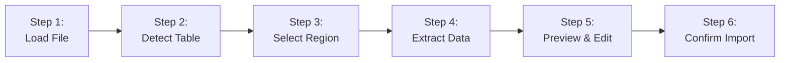

# Mechanical Schedule Import Enhancement Plan

## Current Problems

**UI Clutter**: 6+ overlapping buttons on Mechanical Units tab

- "Import Mechanical Schedule from Image" (whole image only)
- "Import Mechanical Schedule from PDF" (whole PDF only)  
- "Free Select" / "Select Column" / "Select Row" (PDF viewer modes)
- "Import Selected Column" / "Import Selected Row" (requires manual labeling)
- "Manual Component Add"

**Workflow Issues**:

- No selection capability for images (only PDFs)
- Multi-step process: Load PDF → Set mode → Draw selection → Enter label → Import
- No preview/validation before database commit
- OCR errors go directly to database without user review

**Technical Limitations**:

- Tesseract OCR has accuracy issues with complex tables
- Grid detection fails on tables without clear borders
- No dedicated table structure recognition

---

## Proposed Solution: Unified Import Wizard

### 1. Button Consolidation

**Replace current buttons with:**

**Mechanical Units Tab**:

```
┌─────────────────────────────────────────────────────────┐
│ [Import Schedule Wizard...]  [Manual Add]  [Edit] [Del] │
└─────────────────────────────────────────────────────────┘
```

**Remove these buttons**:

- ❌ "Import Mechanical Schedule from Image" 
- ❌ "Import Mechanical Schedule from PDF"
- ❌ "Import Selected Column"
- ❌ "Import Selected Row"
- ❌ "Free Select" / "Select Column" / "Select Row" (move into wizard)

**File Preview section** becomes optional (keep for reference viewing, but import goes through wizard)

---

### 2. Import Wizard Architecture

Create new dialog: `**MechanicalScheduleImportWizard**` ([src/ui/dialogs/mechanical_schedule_import_wizard.py](src/ui/dialogs/mechanical_schedule_import_wizard.py))

**Multi-step workflow:**




#### **Step 1: Load File**

- Support: PDF, PNG, JPG, TIFF
- Display file preview with zoom/pan
- Auto-detect if multiple pages (for PDFs)
- Page selector for multi-page PDFs

#### **Step 2: Auto-Detect Tables** (NEW)

- Run table detection model on loaded image/page
- Highlight detected table regions with bounding boxes
- Show confidence scores
- User can accept auto-detection or proceed to manual selection

#### **Step 3: Select Region**

- **For Auto-Detected**: Click detected region to select
- **Manual Mode**: Draw rectangle over table area
- **Selection Refinement**: Drag corners to adjust boundaries
- **Multiple Regions**: Support selecting multiple tables on one page

#### **Step 4: Extract Data**

- Run OCR pipeline on selected region(s)
- Use improved OCR stack (see OCR Improvements section)
- Show progress bar with status
- Display extraction confidence scores

#### **Step 5: Preview & Validation** (NEW - Critical Feature)

**Side-by-side layout:**

```
┌──────────────────────────────────────────────────────┐
│ Source Image                │  Extracted Data        │
│ (with overlay highlighting) │  (editable table)      │
│                             │                        │
│ [Show: Headers|Data|Both]   │  [Column Mapping...]   │
│                             │  [Issue Detection: 3]  │
└──────────────────────────────────────────────────────┘
```

**Features:**

- **Editable Grid**: User can correct OCR errors directly
- **Column Mapping**: Auto-map or manually assign columns to:
  - Unit Name/Mark
  - Unit Type  
  - 8 frequency bands (63, 125, 250, 500, 1K, 2K, 4K, 8K)
  - Inlet/Radiated/Outlet sections
- **Issue Highlighting**: 
  - Missing frequency values (red background)
  - Invalid numeric values (yellow background)
  - Duplicate unit names (orange background)
- **Row Selection**: Checkboxes to include/exclude rows
- **Batch Edit**: Set unit type for multiple rows at once

#### **Step 6: Confirm Import**

- Summary: "Importing X units with Y total frequency values"
- Option: "Create backup before import"
- Option: "Skip duplicates" or "Update existing units"
- Final confirmation button

---

## 3. OCR & Table Detection Improvements

### Current Stack (Keep as Fallback)

- OpenCV grid detection
- Tesseract OCR (local)

### Enhanced Stack (Add These)

#### **Tier 1: Better Local Table Detection** (RECOMMENDED - No Internet Required)

**Add Table Transformer model:**

- Library: `transformers` + `torch`
- Model: `microsoft/table-transformer-detection` and `microsoft/table-transformer-structure-recognition`
- Purpose: Detect table boundaries and structure (rows/columns) with high accuracy
- File: [src/calculations/table_detection.py](src/calculations/table_detection.py)

```python
# New function: detect_table_structure()
# Returns: List[TableRegion] with bounding boxes and cell grid
```

**Add PaddleOCR or EasyOCR** (Better than Tesseract):

- Library: `paddleocr` or `easyocr`  
- Benefits: Better accuracy on mixed fonts, rotated text, poor quality scans
- Supports CPU and GPU inference
- File: [src/calculations/enhanced_ocr.py](src/calculations/enhanced_ocr.py)

```python
# New function: extract_table_with_paddle()
# Fallback chain: PaddleOCR → EasyOCR → Tesseract
```

#### **Tier 2: Cloud OCR APIs** (Optional Premium Feature)

**Add as user preference:**

- Google Vision API (table detection + OCR)
- AWS Textract (excellent for tables)
- Azure Document Intelligence

**Implementation:**

- Settings: "Enable Cloud OCR" checkbox with API key input
- Fallback to local if API fails or not configured
- File: [src/calculations/cloud_ocr.py](src/calculations/cloud_ocr.py)

---

## 4. Data Validation System

Create new validation module: [src/calculations/schedule_validator.py](src/calculations/schedule_validator.py)

**Validation Rules:**

```python
class ScheduleValidator:
    def validate_mechanical_unit(self, row_data) -> ValidationResult:
        """
        Checks:
        - Name is not empty
        - Frequency values are numeric and in valid range (0-150 dB)
        - All 8 bands present for each section (Inlet/Radiated/Outlet)
        - Unit type is recognized or valid custom type
        - No duplicate unit names in current batch
        """
        
    def auto_fix_common_issues(self, row_data) -> RowData:
        """
        Auto-corrections:
        - "1k" → "1000", "2k" → "2000" (frequency normalization)
        - Remove "dB" suffix from numeric values
        - Strip whitespace
        - Fix OCR confusions: "O" → "0", "l" → "1"
        """
        
    def suggest_column_mapping(self, headers, sample_rows) -> ColumnMapping:
        """
        Smart column detection:
        - Look for "Mark", "Unit", "Type" keywords
        - Detect 8-column frequency band sequences
        - Identify Inlet/Radiated/Outlet sections by position or headers
        """
```

---

## 5. Implementation Architecture

### New Files

**Core Wizard:**

- [src/ui/dialogs/mechanical_schedule_import_wizard.py](src/ui/dialogs/mechanical_schedule_import_wizard.py) - Main wizard dialog (400-600 lines)

**OCR Enhancements:**

- [src/calculations/table_detection.py](src/calculations/table_detection.py) - Table Transformer integration (150-200 lines)
- [src/calculations/enhanced_ocr.py](src/calculations/enhanced_ocr.py) - PaddleOCR/EasyOCR wrappers (200-250 lines)
- [src/calculations/cloud_ocr.py](src/calculations/cloud_ocr.py) - Cloud API integrations (200 lines)

**Validation:**

- [src/calculations/schedule_validator.py](src/calculations/schedule_validator.py) - Validation and auto-correction (250-300 lines)

**Widgets:**

- [src/ui/widgets/table_preview_widget.py](src/ui/widgets/table_preview_widget.py) - Side-by-side preview with editing (300-400 lines)
- [src/ui/widgets/column_mapper_dialog.py](src/ui/widgets/column_mapper_dialog.py) - Interactive column mapping (150-200 lines)

### Modified Files

**Component Library Dialog:**

- [src/ui/dialogs/component_library_dialog.py](src/ui/dialogs/component_library_dialog.py)
  - Remove old import buttons and selection mode buttons
  - Add single "Import Schedule Wizard..." button
  - Connect to new wizard dialog
  - Keep PDF preview panel (optional, for reference viewing)

**Existing OCR Scripts** (Keep as Fallback):

- [src/calculations/image_table_to_csv.py](src/calculations/image_table_to_csv.py) - Keep for backward compatibility
- [src/calculations/pdf_table_to_mechanical_units.py](src/calculations/pdf_table_to_mechanical_units.py) - Keep as fallback

---

## 6. User Workflow Comparison

### ❌ Current Workflow (Image Import)

```
1. Click "Import Mechanical Schedule from Image"
2. Select image file
3. Wait for OCR (no preview)
4. Data imported directly to database
5. Check Component Library list to see if import worked
6. If errors: manually edit each unit in database
```

**Problems**: No selection, no preview, no validation, errors persist in database

### ❌ Current Workflow (PDF Region Import)

```
1. Click "Load PDF..."
2. Select PDF file
3. Click selection mode button (Free/Column/Row)
4. Draw rectangle on PDF
5. Type label manually (e.g., "Inlet 500")
6. Click "Import Selected Column" or "Import Selected Row"
7. Repeat for each column/row
8. No validation or preview
```

**Problems**: Tedious, error-prone labeling, no batch import, no validation

### ✅ New Workflow (Import Wizard)

```
1. Click "Import Schedule Wizard..."
2. Load image or PDF
   └─ Auto-detect tables (click to select) OR draw selection
3. OCR extracts data with progress indicator
4. Preview side-by-side:
   ├─ Edit any cell with errors
   ├─ Map columns automatically or manually
   ├─ Review highlighted issues
   └─ Exclude bad rows
5. Click "Import X Units"
6. Done - validated data in database
```

**Benefits**: Single workflow, visual validation, batch editing, confidence scores

---

## 7. Dependencies & Setup

### New Python Packages

Add to [requirements.txt](requirements.txt):

```txt
# Table Detection & Recognition
torch>=2.0.0
torchvision>=0.15.0
transformers>=4.30.0
timm>=0.9.0

# Enhanced OCR (choose one or both)
paddleocr>=2.7.0        # Recommended: Better accuracy, CPU/GPU
# OR
easyocr>=1.7.0          # Alternative: Lightweight, good for English

# Cloud OCR (optional)
google-cloud-vision>=3.4.0   # Optional
boto3>=1.28.0                # Optional (AWS Textract)
azure-ai-formrecognizer>=3.3.0  # Optional
```

### Model Downloads

**Table Transformer** (one-time download, ~100MB):

```python
# Auto-downloaded on first use
from transformers import AutoModelForObjectDetection
model = AutoModelForObjectDetection.from_pretrained(
    "microsoft/table-transformer-detection"
)
```

**PaddleOCR** (auto-downloads models ~10MB per language)

---

## 8. Testing & Validation Plan

### Test Cases

**TC1: Simple bordered table** (mechanical schedule with clear grid lines)

- Expected: Auto-detection finds table, extraction is 95%+ accurate

**TC2: Borderless table** (text-only, space-separated columns)

- Expected: Table Transformer detects structure, column mapping required

**TC3: Poor quality scan** (faded, skewed, low resolution)

- Expected: PaddleOCR outperforms Tesseract, user can edit errors in preview

**TC4: Multi-page PDF** (schedule spans multiple pages)

- Expected: User can process page-by-page or batch process all pages

**TC5: Partial region selection** (import only 3 units from a 20-unit table)

- Expected: User draws selection, only selected region is extracted

**TC6: Missing frequency bands** (table has only 4 of 8 bands)

- Expected: Validation highlights missing bands, user can leave empty or fill manually

**TC7: Duplicate unit names** (schedule has two "AHU-1" entries)

- Expected: Validation warns about duplicates, user can rename or merge

---

## 9. Progressive Implementation Roadmap

### Phase 1: Core Wizard (1-2 weeks)

- ✅ Create `MechanicalScheduleImportWizard` dialog with 6 steps
- ✅ File loading (image + PDF support)
- ✅ Manual region selection with rectangle tool
- ✅ Preview & validation grid (editable table)
- ✅ Connect wizard to Component Library dialog
- ✅ Replace old import buttons

**Outcome**: Functional wizard with manual selection and preview (no auto-detection yet)

### Phase 2: OCR Enhancements (1 week)

- ✅ Integrate PaddleOCR or EasyOCR
- ✅ Create fallback chain: Enhanced OCR → Tesseract
- ✅ Add confidence scores to preview
- ✅ Improve preprocessing pipeline

**Outcome**: Better OCR accuracy, fewer manual corrections needed

### Phase 3: Auto-Detection (1 week)

- ✅ Integrate Table Transformer model
- ✅ Auto-detect table regions on file load
- ✅ Show detection bounding boxes with confidence
- ✅ Allow user to refine or override detections

**Outcome**: Users can accept auto-detected tables instead of drawing manually

### Phase 4: Validation & Intelligence (1 week)

- ✅ Implement `ScheduleValidator` with rules
- ✅ Add auto-correction for common OCR errors
- ✅ Smart column mapping suggestions
- ✅ Duplicate detection and merge options

**Outcome**: Robust validation with intelligent error handling

### Phase 5: Cloud OCR (Optional, 3-5 days)

- ✅ Add settings for API keys
- ✅ Implement Google Vision or AWS Textract integration
- ✅ Fallback to local if cloud unavailable

**Outcome**: Premium accuracy option for challenging documents

---

## 10. UI Mockups

### Import Wizard - Step 3: Select Region

```
┌──────────────────────────────────────────────────────────────┐
│  Mechanical Schedule Import Wizard             [Step 3 of 6] │
├──────────────────────────────────────────────────────────────┤
│                                                               │
│  ┌────────────────────────────────────────────────────────┐  │
│  │  PDF/Image Preview                       [Zoom: 100%] │  │
│  │                                                        │  │
│  │     ┏━━━━━━━━━━━━━━━━━━━━━━━━━━━━━━━━━━┓ ← Detected   │  │
│  │     ┃ MECHANICAL SCHEDULE             ┃   Table      │  │
│  │     ┃ Mark │ Type │ 63 │125│250│...  ┃   (87% conf) │  │
│  │     ┃──────┼──────┼────┼───┼───┼───  ┃              │  │
│  │     ┃ AHU-1│ RTU  │ 78 │85 │92 │...  ┃              │  │
│  │     ┃ AHU-2│ AHU  │ 75 │82 │88 │...  ┃              │  │
│  │     ┗━━━━━━━━━━━━━━━━━━━━━━━━━━━━━━━━━━┛              │  │
│  │                                                        │  │
│  │  [◉ Use Auto-Detection]  [ ] Manual Selection         │  │
│  └────────────────────────────────────────────────────────┘  │
│                                                               │
│  Detection Results:                                           │
│  • Table 1: Mechanical Schedule (87% confidence) ✓ Selected  │
│  • Table 2: Notes/Legend (45% confidence)                    │
│                                                               │
│  [< Back]              [Refine Selection]      [Next: Extract >] │
└──────────────────────────────────────────────────────────────┘
```

### Import Wizard - Step 5: Preview & Edit

```
┌────────────────────────────────────────────────────────────────────┐
│  Mechanical Schedule Import Wizard                   [Step 5 of 6] │
├────────────────────────────────────────────────────────────────────┤
│  ┌──────────────────────┬──────────────────────────────────────┐  │
│  │ Source Image         │ Extracted Data (Editable)            │  │
│  │                      │                                      │  │
│  │ [Highlight: Data]    │  Issues: 3  [Show All] [Auto-Fix]   │  │
│  │ ┌────────────────┐   │                                      │  │
│  │ │ MECH SCHEDULE  │   │  ☑ Name    Type   63  125  250 ...  │  │
│  │ │ Mark│Type│63..│   │  ☑ AHU-1   RTU    78  85   92  ...   │  │
│  │ │ AHU-1│RTU│78..│   │  ☑ AHU-2   AHU    75  82   88  ...   │  │
│  │ │ AHU-2│AHU│75..│   │  ☑ RF-1    RF     --  72   78  ...   │  │
│  │ │ RF-1 │RF │72..│   │     └─ Missing 63Hz value (red)      │  │
│  │ └────────────────┘   │                                      │  │
│  │ Zoom: [+][-][Fit]    │  Column Mapping: [Edit Mapping...]  │  │
│  └──────────────────────┴──────────────────────────────────────┘  │
│                                                                    │
│  Validation Summary:                                               │
│  • ⚠ 1 missing frequency value (RF-1, 63Hz band)                 │
│  • ⚠ 2 units missing "Radiated" section - using Outlet only      │
│                                                                    │
│  [< Back]        [Export CSV...]        [Next: Confirm Import >]  │
└────────────────────────────────────────────────────────────────────┘
```

---

## 11. Settings Integration

Add to Project Settings dialog:

**OCR & Import Settings** section:

```
┌─────────────────────────────────────────────────┐
│ Table Import Preferences                        │
│                                                 │
│ OCR Engine:                                     │
│ ( ) Basic (Tesseract - Fastest)                │
│ (•) Enhanced (PaddleOCR - Recommended)          │
│ ( ) Cloud API (Requires API key)               │
│                                                 │
│ Auto-Detection:                                 │
│ [✓] Enable automatic table detection           │
│ [✓] Show confidence scores                     │
│ Minimum confidence threshold: [75]%             │
│                                                 │
│ Validation:                                     │
│ [✓] Auto-fix common OCR errors                 │
│ [✓] Highlight missing frequency values         │
│ [✓] Warn on duplicate unit names               │
│                                                 │
│ Cloud API Settings (Optional):                  │
│ Service: [Google Vision ▼]                     │
│ API Key: [************************]            │
│                                                 │
└─────────────────────────────────────────────────┘
```

---

## Key Benefits

### For Users:

✅ **Single unified workflow** instead of 6+ confusing buttons
✅ **Visual validation** - see extraction before committing to database  
✅ **Error correction** - edit OCR mistakes in-place
✅ **Confidence** - know data quality before import
✅ **Efficiency** - batch process entire schedules with preview
✅ **Flexibility** - auto-detection or manual selection

### For System:

✅ **Data quality** - validation prevents bad data in database
✅ **Better OCR** - modern models (Table Transformer, PaddleOCR) >> Tesseract
✅ **Maintainability** - consolidated code in wizard instead of scattered buttons
✅ **Extensibility** - easy to add new features to wizard steps
✅ **Backward compatible** - old OCR scripts remain as fallback

---

## Success Metrics

**Measure improvement by:**

- Import time: From 5-10 minutes → 2-3 minutes (with auto-detection)
- OCR accuracy: From ~70-80% → 90-95% (with PaddleOCR)
- Error correction time: From 5-15 minutes manual DB editing → 1-2 minutes in preview
- User satisfaction: Track feature usage and feedback
- Database data quality: Fewer incomplete or incorrect mechanical units

---

## Risk Mitigation

**Risk 1: Model download size (~100MB for Table Transformer)**

- Mitigation: Optional download on first use, show progress, cache locally

**Risk 2: GPU requirement for best performance**

- Mitigation: All models support CPU inference (slower but functional)

**Risk 3: Learning curve for new wizard**

- Mitigation: Keep old workflow as "Quick Import" option, add in-app tutorial

**Risk 4: OCR still imperfect even with better models**

- Mitigation: This is why preview/validation is critical - user always verifies

---

## Conclusion

This plan transforms a confusing, error-prone set of import buttons into a **guided, validated workflow** with modern AI-powered table detection and OCR. The wizard approach ensures users never commit bad data to the database while making imports faster and more reliable.

**Next Steps After Plan Approval:**

1. Set up development branch
2. Install and test Table Transformer + PaddleOCR
3. Build wizard UI framework (Steps 1-6)
4. Implement preview/validation grid
5. Integrate enhanced OCR pipeline
6. User testing and iteration

