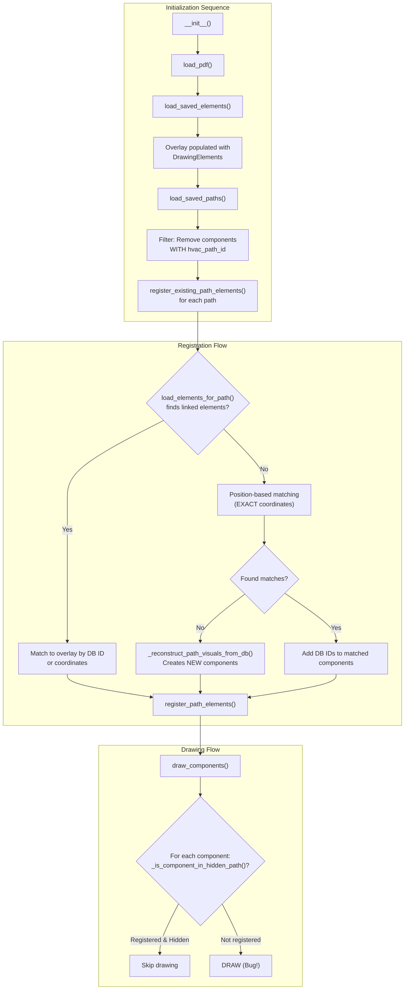

# HVAC Path Component Visibility Bug Analysis

## Problem Statement

When hiding an HVAC path using the eye button in the Saved Paths list, **segment lines disappear correctly** but **component circles remain visible**. This document analyzes the root causes and proposes structural fixes.

---

## Architecture Overview

The system has three overlapping data representations that are not properly synchronized:

| Data Layer | Purpose | Storage | Key Fields |
|------------|---------|---------|------------|
| **DrawingElement** | Visual overlay representation | `drawing_elements` table | `hvac_path_id`, `hvac_component_id`, `x_position`, `y_position` |
| **HVACComponent** | Acoustic model object | `hvac_components` table | `x_position`, `y_position`, `component_type` |
| **Path Registration** | Visibility tracking | In-memory `path_element_mapping` | Component/segment object references |

---

## Data Flow Diagram



---

## Identified Problems

### Problem 1: Chicken-and-Egg Filter Timing

**Location:** `src/ui/drawing_interface.py` lines 2923-2930

```python
# This filter runs BEFORE path IDs are added to components
self.drawing_overlay.components = [
    c for c in self.drawing_overlay.components 
    if not c.get('hvac_path_id') and not c.get('db_path_id')
]
```

**Issue:** The filter removes components based on `hvac_path_id`, but:
1. Components loaded from `load_saved_elements()` may not have this ID
2. Path IDs are only added during `register_existing_path_elements()` which runs AFTER the filter
3. Result: Components without path IDs survive the filter, creating duplicates

---

### Problem 2: Inconsistent Coordinate Matching in Position-Based Matching

**Location:** `src/ui/drawing_interface.py` lines 3847-3858

```python
# Component matching uses EXACT coordinates
if (comp.get('x') == db_comp.x_position and
    comp.get('y') == db_comp.y_position and
    comp.get('component_type') == db_comp.component_type):
```

**Comparison - Segment matching uses FUZZY tolerance:**

```python
# Segment matching (lines 3877-3891)
tol = 12.0  # pixels
if d1 <= tol and d2 <= tol:
```

**Issue:** Due to zoom-related coordinate differences (rounding, different `saved_zoom` values), exact matching often fails for components while fuzzy matching succeeds for segments.

---

### Problem 3: Inconsistent Matching in `register_path_elements()`

**Location:** `src/drawing/drawing_overlay.py` lines 1959-1964 vs 1986

**Component fallback matching (EXACT):**
```python
if (overlay_comp.get('x') == comp.get('x') and 
    overlay_comp.get('y') == comp.get('y') and
    overlay_comp.get('component_type') == comp.get('component_type')):
```

**Segment fallback matching (FUZZY via `_segments_match()`):**
```python
if self._segments_match(overlay_seg, seg):
```

**Issue:** Even when components reach `register_path_elements()`, the fallback coordinate matching uses exact comparison and fails due to zoom-related coordinate drift.

---

### Problem 4: Missing DB IDs on Existing Components

**Location:** `src/ui/drawing_interface.py` lines 4005-4007

```python
if existing_comp:
    # Use existing component - but NO DB IDs added!
    path_components.append(existing_comp)
```

**Issue:** When an existing overlay component is found during reconstruction, it doesn't receive DB IDs (`db_component_id`, `hvac_path_id`), making visibility matching fail later.

---

### Problem 5: No Zoom Normalization in Coordinate Comparisons

**Location:** Multiple places in `src/ui/drawing_interface.py`

Components may have different `saved_zoom` values:
- Original DrawingElements saved at one zoom level
- HVACComponent positions stored at base zoom (1.0)
- Current overlay at yet another zoom level

Without normalizing to a common base, coordinate comparisons fail even with fuzzy tolerance.

---

## Result: Duplicate Unregistered Components

After all registration logic completes:

```
┌─────────────────────────────────────────────────────────────────────────┐
│  self.drawing_overlay.components                                        │
│                                                                         │
│  ┌────────────────────┐  ┌────────────────────┐  ┌────────────────────┐│
│  │ Original Comp A    │  │ Original Comp B    │  │ Reconstructed A'   ││
│  │ x=152, y=98        │  │ x=301, y=150       │  │ x=150, y=100       ││
│  │ NO hvac_path_id    │  │ NO hvac_path_id    │  │ db_component_id=1  ││
│  │ NOT filtered       │  │ NOT filtered       │  │ hvac_path_id=5     ││
│  │ NOT registered     │  │ NOT registered     │  │ REGISTERED         ││
│  │ ↓                  │  │ ↓                  │  │ ↓                  ││
│  │ VISIBLE (Bug!)     │  │ VISIBLE (Bug!)     │  │ HIDDEN (correct)   ││
│  └────────────────────┘  └────────────────────┘  └────────────────────┘│
└─────────────────────────────────────────────────────────────────────────┘
```

---

## Proposed Solutions

### Option A: Filter by Coordinate Proximity Instead of Path ID

**Concept:** Remove components from overlay based on proximity to ANY path's component positions, not by checking for `hvac_path_id`.

**Location:** `src/ui/drawing_interface.py` in `load_saved_paths()`, replace lines 2921-2930

**Implementation:**
```python
# Collect all path component positions first
path_component_positions = set()
for hvac_path in hvac_paths:
    for seg in hvac_path.segments:
        if seg.from_component:
            path_component_positions.add(
                (seg.from_component.x_position or 0, seg.from_component.y_position or 0)
            )
        if seg.to_component:
            path_component_positions.add(
                (seg.to_component.x_position or 0, seg.to_component.y_position or 0)
            )

def is_near_path_position(comp):
    """Check if component is near any path component position."""
    comp_zoom = comp.get('saved_zoom') or 1.0
    if comp_zoom <= 0:
        comp_zoom = 1.0
    comp_x = comp.get('x', 0) / comp_zoom
    comp_y = comp.get('y', 0) / comp_zoom
    tol = 15.0  # pixels tolerance
    for px, py in path_component_positions:
        if abs(comp_x - (px or 0)) < tol and abs(comp_y - (py or 0)) < tol:
            return True
    return False

# Remove components near path positions (will be re-added during registration)
self.drawing_overlay.components = [
    c for c in self.drawing_overlay.components 
    if not is_near_path_position(c)
]
```

**Pros:**
- Removes duplicate sources before registration
- Works regardless of whether `hvac_path_id` was saved

**Cons:**
- May incorrectly remove components at similar positions that belong to different drawings
- Requires fetching all path data before filtering

---

### Option B: Fix `register_path_elements()` to Use Fuzzy Matching

**Concept:** Make component registration use the same fuzzy matching logic as segments.

**Location:** `src/drawing/drawing_overlay.py` lines 1958-1964

**Implementation:**
```python
# Replace exact matching:
# if (overlay_comp.get('x') == comp.get('x') and 
#     overlay_comp.get('y') == comp.get('y') and
#     overlay_comp.get('component_type') == comp.get('component_type')):

# With fuzzy matching using existing _components_match():
if self._components_match(overlay_comp, comp):
    registered_components.append(overlay_comp)
    found = True
    break
```

**Pros:**
- Simple change
- Uses existing `_components_match()` which already handles zoom normalization

**Cons:**
- Doesn't address the duplicate component issue
- Components will still exist twice but both should be registered

---

### Option C: Fix Position Matching with Fuzzy + Zoom Normalization

**Concept:** Update position-based matching in `register_existing_path_elements()` to use fuzzy tolerance with zoom normalization.

**Location:** `src/ui/drawing_interface.py` lines 3847-3858 and 3866-3874

**Implementation:**
```python
# Replace exact matching with fuzzy + zoom normalized:
tol = 12.0  # pixels tolerance
db_x = db_comp.x_position or 0
db_y = db_comp.y_position or 0

for comp in drawing_components:
    # Normalize overlay component to base coordinates
    comp_zoom = comp.get('saved_zoom') or 1.0
    if comp_zoom <= 0:
        comp_zoom = 1.0
    comp_base_x = comp.get('x', 0) / comp_zoom
    comp_base_y = comp.get('y', 0) / comp_zoom
    
    if (abs(comp_base_x - db_x) <= tol and
        abs(comp_base_y - db_y) <= tol and
        comp.get('component_type') == db_comp.component_type):
        if comp not in path_components:
            path_components.append(comp)
            # Add ALL required IDs for visibility matching
            comp['db_component_id'] = db_comp.id
            comp['hvac_component_id'] = db_comp.id
            comp['db_path_id'] = hvac_path.id
            comp['hvac_path_id'] = hvac_path.id
        found = True
        break
```

**Pros:**
- Prevents reconstruction by finding existing components
- Adds all required IDs for visibility matching

**Cons:**
- Doesn't prevent duplicates if reconstruction still happens
- Multiple matching code paths to maintain

---

### Option D: Add DB IDs to Existing Components in Reconstruction

**Concept:** When reconstruction finds an existing component, add all necessary IDs.

**Location:** `src/ui/drawing_interface.py` lines 4005-4007

**Implementation:**
```python
if existing_comp:
    # Use existing component, but ensure it has all DB IDs
    existing_comp['db_component_id'] = db_comp.id
    existing_comp['hvac_component_id'] = db_comp.id
    existing_comp['db_path_id'] = hvac_path.id
    existing_comp['hvac_path_id'] = hvac_path.id
    path_components.append(existing_comp)
```

**Pros:**
- Ensures existing components can be matched during visibility checks

**Cons:**
- Only helps if existing components are found (depends on coordinate matching working)

---

## Recommended Implementation Plan

### ✅ CODE ANALYSIS COMPLETE - BUGS CONFIRMED

After thorough code exploration, **all 4 bugs have been confirmed**, plus one additional issue was discovered:

**Bug #1 (Filter Timing):** CONFIRMED - Filter at lines 2923-2926 runs before IDs are assigned
**Bug #2 (Position Matching):** CONFIRMED - Exact matching at lines 3850-3852, no zoom normalization
**Bug #3 (Registration Matching):** CONFIRMED - Exact fallback at lines 1959-1961, `_components_match()` exists but unused
**Bug #4 (Reconstruction IDs):** CONFIRMED - Line 3979 doesn't add IDs to existing components
**Bug #5 (NEW DISCOVERY):** Linked element loading (lines 3736-3750) also doesn't add IDs to existing components

### Implementation Sequence

For a complete fix, implement **all 5 phases in order**:

### Phase 1: Fix Registration Matching (Option B) - HIGHEST PRIORITY
**File:** `src/drawing/drawing_overlay.py` lines 1959-1964
**Change:** Replace exact matching with `self._components_match(overlay_comp, comp)`
**Impact:** Most frequently used code path - fixes future registrations immediately

### Phase 2: Fix Position Matching (Option C) - CORE LOGIC
**File:** `src/ui/drawing_interface.py` lines 3850-3858
**Changes:**
- Add zoom normalization: `comp_base_x = comp.get('x', 0) / comp_zoom`
- Use 12px tolerance (matching segments)
- Add ALL 4 IDs: `db_component_id`, `hvac_component_id`, `db_path_id`, `hvac_path_id`
**Impact:** Primary matching logic for position-based registration

### Phase 3: Fix Linked Element Loading (NEW) - PARALLEL PATH
**File:** `src/ui/drawing_interface.py` lines 3736-3750
**Change:** Add all 4 IDs to existing components after match
**Impact:** Fixes component loading through DrawingElement path

### Phase 4: Fix Reconstruction (Option D) - SAFETY NET
**File:** `src/ui/drawing_interface.py` line 3979
**Change:** Add all 4 IDs to existing_comp before appending
**Impact:** Ensures reconstruction fallback adds IDs

### Phase 5: Enhanced Filter (Option A) - DEFENSIVE (OPTIONAL)
**File:** `src/ui/drawing_interface.py` lines 2923-2930
**Change:** Add proximity-based filtering as backup to ID-based filter
**Impact:** Safety net for edge cases where IDs might not be assigned

---

## Testing Checklist

After implementing fixes:

- [ ] Create new HVAC path with multiple components
- [ ] Save the path
- [ ] Close and reopen the drawing
- [ ] Toggle path visibility using eye button - verify ALL components and segments hide together
- [ ] Test "Hide All" button - verify complete paths disappear
- [ ] Test "Show All" button - verify complete paths reappear
- [ ] Test at different zoom levels (50%, 100%, 150%)
- [ ] Test with multiple paths - hiding one shouldn't affect others
- [ ] Check debug console for "Warning - could not find overlay component" messages

---

## Files to Modify

| File | Changes |
|------|---------|
| `src/ui/drawing_interface.py` | Options A, C, D (filter, position matching, reconstruction) |
| `src/drawing/drawing_overlay.py` | Option B (registration matching) |

---

## Related Code References

- Filter logic: `drawing_interface.py:2921-2930`
- Position matching (from_component): `drawing_interface.py:3844-3858`
- Position matching (to_component): `drawing_interface.py:3860-3874`
- Segment matching (fuzzy): `drawing_interface.py:3876-3905`
- Reconstruction existing check: `drawing_interface.py:3997-4007`
- Registration component matching: `drawing_overlay.py:1942-1967`
- Registration segment matching: `drawing_overlay.py:1969-1992`
- Visibility check: `drawing_overlay.py:1198-1239`
- Component match helper: `drawing_overlay.py:1766-1787`
- Segment match helper: `drawing_overlay.py:1789-1816`
